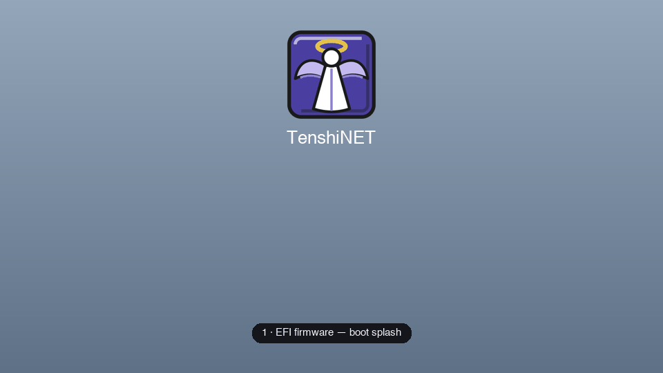

# TenshiNET boot-sequence animation

`boot-sequence.gif` / `boot-sequence.mp4` walk the full boot chain:

1. **EFI firmware** — the boot splash (`tenshistep-refind/efi-splash/`)
2. **rEFInd** — the boot menu (same banner, entry icons below)
3. **Plymouth** — kernel boot, progress bar filling
4. **SDDM** — the login greeter
5. **Plasma** — the desktop (matching wallpaper + panel)

The point of the piece: the **angel + TenshiNET banner holds one fixed
position** (top ≈ 7%, height ≈ 26%) through every stage, so each hand-off is a
seamless cross-fade of the lower-screen content rather than a jump. Light theme
shown; the dark variant uses the same layout on the near-black gradient.

Rendered from the actual theme assets via the same mock pipeline used for the
previews (no live Plasma/SDDM/rEFInd on hand) — treat it as an accurate layout
mock-up of the intended sequence rather than a screen capture.
