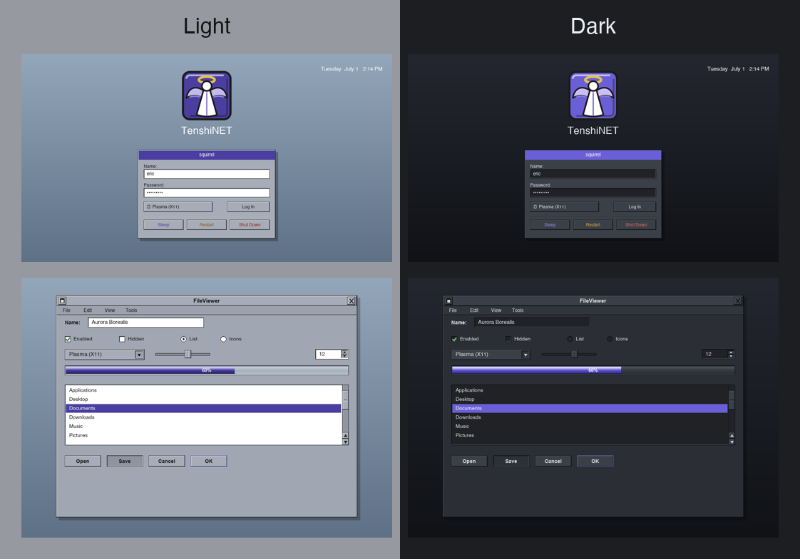
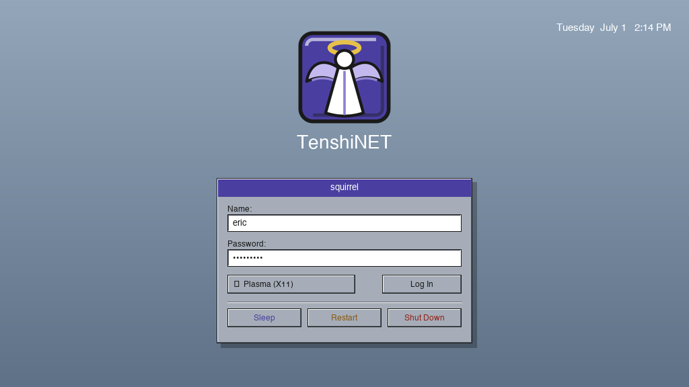
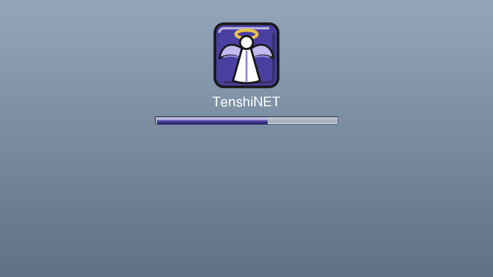
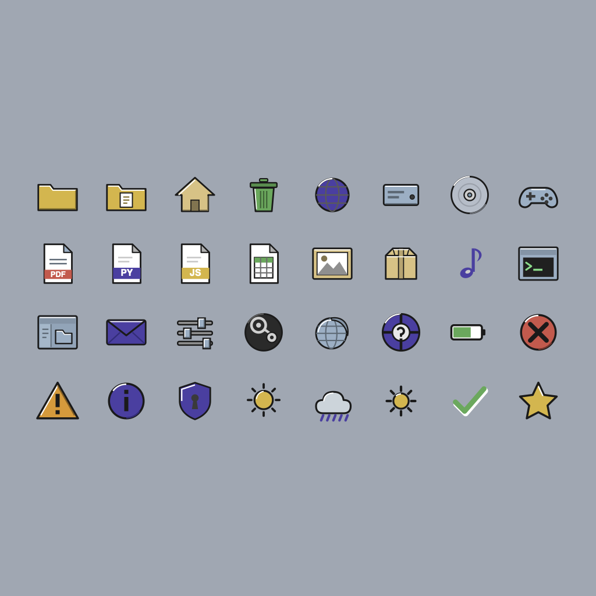
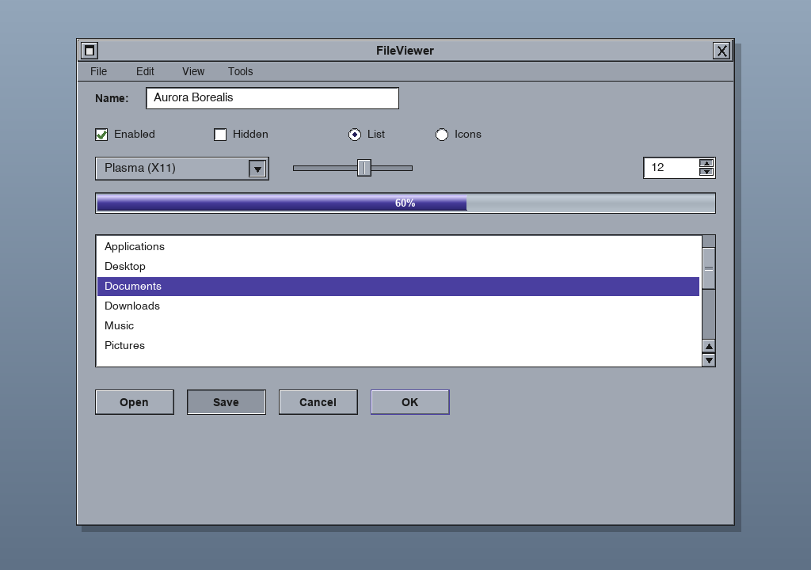
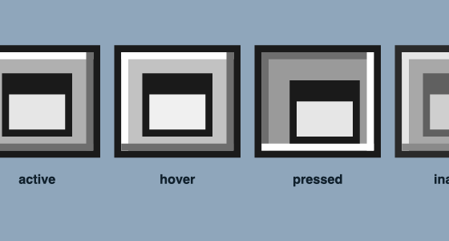

# TenshiSTEP for KDE Plasma

A NeXTSTEP/OpenStep-inspired theme bundle for KDE Plasma (5 and 6). It aims
for the classic NeXT look: flat grayscale palette, chiseled bevels (white
highlight on the top/left, dark shadow on the bottom/right), black title
text, and square title-bar buttons.


**Emblem.** `emblem.svg` / `emblem.png` in the bundle root is the standalone TenshiNET angel tile; the Global Theme uses it as its icon (`KPlugin.Icon = tenshistep`, resolved from the bundled icon set).


**Wallpaper / Plymouth handoff.** `wallpaper/TenshiNET-<WxH>.png` (1280×720,1920×1080, 2560×1440, 3840×2160) is the desktop background that *matches the Plymouth boot splash* — same gradient and the TenshiNET angel in the exact position Plymouth places it — so the machine fades seamlessly from boot into the desktop. The Global Theme ships the 1080p one (`contents/wallpaper.png`, wired via `defaults`); the angel is also available as the launcher/menu icon name `tenshix` (and `tenshistep`) in the icon set. The Plasma desktop style ships a `widgets/combobox.svg` giving dropdowns the same NeXT recessed inset well (where the running Plasma ComboBox honours it). For a pixel-exact handoff pick the file matching your native resolution and set it (desktop **and** SDDM background) with fill mode *Centered* so it is not rescaled.

## Previews

Rendered mocks of the OPENSTEP colour look each piece produces (same palette,
bevels and geometry as the actual theme files; not live screenshots).

The light and dark variants side by side (login + widgets):



| | |
|---|---|
| **Login greeter** (SDDM) | **Boot splash** (Plymouth) |
|  |  |
| **Colour icon theme** | **Widgets** (QStyle / Kvantum / QSS) |
|  |  |

The widget shot shows the NeXT chiselled bevels, the twin-arrows-at-the-bottom
scrollbar with a dimpled knob, and the 3D metallic progress bar. Detail of the
miniaturize (iconify) button — the OPENSTEP "miniwindow" glyph in each state:



## What's included

| Piece | Path | What it themes |
|-------|------|----------------|
| Color scheme | `color-schemes/TenshiSTEP.colors` | App colors — NeXT grays, white views, dark selection |
| Window decoration | `aurorae/TenshiSTEP/` | Aurorae title bars & borders with beveled square buttons |
| Konsole scheme | `konsole/TenshiSTEP.colorscheme` | Terminal palette (black on white, muted ANSI) |
| Icon theme | `icons/TenshiSTEP/` | OPENSTEP-inspired **colour** icons with the chiselled bevel; inherits Breeze for the rest |
| SDDM login theme | `sddm/TenshiSTEP/` (Qt5) · `sddm/qt6/TenshiSTEP/` (Qt6) | OPENSTEP-style QML greeter — chiselled panel, indigo title bar, colour power buttons |
| Plasma Style | `plasma/desktoptheme/TenshiSTEP/` | NeXT chiselled FrameSvg widgets (panels, plasmoids, buttons, fields, tooltips) |
| Global Theme | `plasma/look-and-feel/org.tenshistep.desktop/` | Look-and-Feel that applies the whole set + boot splash + logout screen |
| Kvantum theme | `kvantum/TenshiSTEP/` | NeXT app-widget style (SVG) for the Kvantum QStyle engine |
| Qt style sheet | `qt-style/TenshiSTEP.qss` | Lightweight NeXT-beveled widget QSS for any Qt app |
| Qt QStyle plugin | `qstyle/` | Native C++ widget style — the full NeXT look (twin-arrow scrollbars, metallic bars) |
| Plymouth splash | `plymouth/tenshistep/` | OPENSTEP boot splash — chiselled cube + metallic-indigo progress |

Application (Qt) widgets have three options, in increasing fidelity: the
**Qt style sheet** (drop-in, no build), the **Kvantum theme** (SVG engine), and
the native **QStyle plugin** (`qstyle/`, compiled C++ — the only one that can do
NeXT's twin-arrows-at-the-bottom scrollbar with a dimpled knob and true metallic
progress bars). The Plasma Style covers panel/plasmoid widgets. A Helvetica-like
font (Nimbus Sans / Liberation Sans) completes the look.

### About the icon theme

KDE references thousands of icon names, so this ships a **curated core set**
(≈202 hand-drawn icons plus ~390 alias links) covering the most visible
surfaces. The icons keep the chiselled NeXT bevel (dark outlines, white
top-left highlights) but are **colourised with a muted, slightly-desaturated
palette inspired by the colour icons of OPENSTEP 4.2** — manila folders, a
green recycler, silver optical media, steel-blue devices, a red PDF band,
blue/green/orange office documents, per-language source-file bands, and
semantic status colours (green OK, red error, amber warning, battery levels,
a gold sun, blue rain). Colour is applied by `tools/colorize.py`, a
re-runnable, category-driven recolour pass; the original grayscale artwork
remains recoverable from git history.

Categories:

- **Places:** folders + typed variants (documents, downloads, pictures, music,
  videos), home, desktop, trash, network folder + workgroup globe.
- **Devices:** hard disk, optical disc, USB flash, SD card, printer, scanner,
  keyboard (+ settings, on-screen), mouse, touchpad, webcam, graphics tablet,
  gamepad, headphones, phone, laptop, network server, wired network, UPS,
  computer. Plus bonus **keyboard-layout keycaps** (`keyboard-layout-us`,
  `-de`, `-fr`, `-es`, `-gb`, `-ru`, `-jp`, `-it`).
- **Actions:** new, save, copy, cut, paste, delete, find, refresh, back/forward,
  up, add/remove, OK, cancel/close, home; view/zoom (in/out/original/fit,
  fullscreen/restore, list, sort asc/desc); and full media transport
  (play/pause/stop, skip, seek, record, eject, repeat, shuffle).
- **Power/session:** shutdown, reboot, log out, lock screen, suspend,
  hibernate, and switch user (the Kickoff/logout menu).
- **Status (panel/tray):** battery (5 levels + charging, with `battery-100`…
  `battery-000` aliases), Wi-Fi signal strength (none→excellent + disconnected),
  Bluetooth (active/disabled), microphone (active/muted), volume high/muted,
  notifications + Do-Not-Disturb, software updates, VPN, brightness high/low,
  airplane mode, presence (online/offline/away/busy), and
  information/question/warning/error.
- **Weather applet:** clear (day/night), few-clouds (day/night), clouds,
  overcast, showers (scattered + rain), snow, storm, fog, windy — with the
  widget's `-night`/`-day`, `many-clouds`, `mist`, `hail`, `rain` aliases.
- **Emblems:** symbolic-link, locked/readonly, important, favorite, shared,
  plus VCS/file states (added, removed, modified, mounted, new, default).
- **MimeTypes:** generic text, HTML, shell script, PDF, fonts, images, audio,
  video, and archives — with family aliases (`image/png`, `audio/mpeg`,
  `video/mp4`, `application/zip`, …).
  - **Source code:** per-language labelled documents — Python, JS, TS, C, C++,
    Java, Go, Rust, Ruby, PHP, JSON, XML, YAML, CSS, Markdown, SQL (+ header
    and MIME-name aliases).
  - **Office:** word processor, spreadsheet, presentation, drawing, calendar —
    aliased to the ODF and OOXML/MS types (`.odt`/`.docx`, `.ods`/`.xlsx`,
    `.odp`/`.pptx`, `.odg`, `.ics`, …).
  - **Optical:** ISO disc images (`application-x-cd-image`) plus audio-CD, DVD,
    Blu-ray, and recordable disc device icons.
- **Launcher/menu:** application launcher (`start-here-kde`/`plasma`/`kickoff`),
  global menu (hamburger), and application grid (`view-app-grid`).
- **Apps:** Konsole, Dolphin, Kate, KWrite, NEdit, Vim, VS Code, Okular,
  Gwenview, Spectacle, System Settings, Klipper, Ark, a mail client
  (Thunderbird/KMail), a media player (Elisa/VLC), graphics (Krita/GIMP),
  calculator (KCalc), help, Chromium, and Firefox — each with the alternate
  names KDE looks up (`org.kde.*`, `chromium-browser`, `code`, …).
- **Games:** Steam, Final Fantasy XIV, Guild Wars 2, and Doom (with launcher
  aliases like `com.valvesoftware.Steam`, `xivlauncher`, `gw2`, `gzdoom`).

The theme **inherits from Breeze**, so any name not provided falls back to
Breeze automatically. Trade-off: until you extend the set, unprovided icons
keep their Breeze (colorful, flat) look alongside the grayscale ones. Add more
SVGs under the matching `icons/TenshiSTEP/<context>/scalable/` folder to grow
coverage.

Note: brand marks (Chromium, Firefox, VS Code, Vim, and the game logos —
Steam, FFXIV, Guild Wars 2, Doom) are **grayscale reinterpretations** in the
NeXT idiom, not the official colored logos.

## Install

```bash
./install.sh
```

This copies the files into
`~/.local/share/{color-schemes,aurorae/themes,konsole,icons}`. Nothing is
installed system-wide and nothing outside `~/.local/share` is touched.

### Manual install (equivalent)

```bash
mkdir -p ~/.local/share/{color-schemes,aurorae/themes,konsole,icons}
cp color-schemes/TenshiSTEP.colors      ~/.local/share/color-schemes/
cp -r aurorae/TenshiSTEP                 ~/.local/share/aurorae/themes/
cp konsole/TenshiSTEP.colorscheme        ~/.local/share/konsole/
cp -R icons/TenshiSTEP                   ~/.local/share/icons/
```

## Apply

- **Colors:** System Settings → Colors → *TenshiSTEP*
  (or `plasma-apply-colorscheme TenshiSTEP`)
- **Window decoration:** System Settings → Window Decorations → *TenshiSTEP*
- **Konsole:** Konsole → Settings → Edit Current Profile → Appearance → *TenshiSTEP*
- **Icons:** System Settings → Icons → *TenshiSTEP*
  (or `plasma-changeicons TenshiSTEP`)

For the authentic NeXT button arrangement, go to
**Window Decorations → Titlebar Buttons** and place **Minimize on the left**
and **Close on the right**.

## SDDM login theme

The login greeter lives under `sddm/TenshiSTEP/` (a self-contained Qt Quick
theme, Qt 5). It recreates the OPENSTEP login panel: a chiselled grey panel
with an indigo title bar, the beveled cube emblem, recessed *Name:* /
*Password:* fields, a session selector, a raised *Log In* button, and colour
power buttons (blue Sleep, amber Restart, red Shut Down) over the muted
OPENSTEP-blue gradient. See `sddm/TenshiSTEP/preview.png`.

SDDM themes are system-wide, so installing needs root:

```bash
sddm/install-sddm.sh            # Qt5 greeter (default), copies to /usr/share/sddm/themes
sddm/install-sddm.sh qt6        # Qt6 greeter (Plasma 6 / SDDM built against Qt 6)
```

Then activate it in `/etc/sddm.conf.d/tenshistep.conf`:

```ini
[Theme]
Current=TenshiSTEP
```

Preview it without logging out:

```bash
sddm-greeter --test-mode --theme /usr/share/sddm/themes/TenshiSTEP
```

Background and panel/title colours are configurable in
`sddm/TenshiSTEP/theme.conf` (set `background=` to a wallpaper path, or
leave it empty for the built-in gradient).

The QML is written to the SDDM greeter API but was authored without a running
SDDM/Qt to execute it — `preview.png` is a faithful SVG mock of the layout, so
treat the first `--test-mode` run as the real check. Two variants ship: the
Qt5 one (`sddm/TenshiSTEP/`) and a Qt6 one (`sddm/qt6/TenshiSTEP/`, with
version-less imports and `function onLoginFailed()` handlers). Both install to
the same theme id; pick the one matching your SDDM's Qt build.

## Global Theme (Look-and-Feel) + splash + logout

`plasma/look-and-feel/org.tenshistep.desktop/` is a **Global Theme**. Its
`contents/defaults` wires the whole set together — TenshiSTEP colour scheme,
icon theme, Plasma Style, and Aurorae decoration — so one click applies
everything:

```bash
lookandfeeltool -a org.tenshistep.desktop     # apply
lookandfeeltool -a org.kde.breeze.desktop        # revert
```

It also ships a **boot splash** (`contents/splash/Splash.qml` — the cube logo
and a filling metallic-indigo progress bar on the OPENSTEP gradient) and a **logout
screen** (`contents/logout/Logout.qml` — NeXT panel with colour Sleep / Restart
/ Shut Down / Log Out / Lock / Cancel buttons).

**Lock screen — deliberate choice:** the package does *not* replace the lock
greeter. A custom lock screen with a mis-bound password/PAM path can lock you
out of the machine, and this QML couldn't be tested here. Instead the stock
lock screen automatically picks up the TenshiSTEP **colour scheme**, so it's
themed without that risk. The splash and logout QML are likewise best-effort
against the documented KSplash / ksmserver APIs — verify after applying, and
revert with the `breeze` command above if anything misbehaves.

## Application widgets (QStyle plugin / Kvantum / QSS)

Three ways to give **Qt application** widgets (buttons, scrollbars, sliders,
menus) the NeXT chiselled look — the one layer the Plasma Style can't reach,
in increasing fidelity:

**Native QStyle plugin** (`qstyle/`, compiled C++ — the fullest option). Only
this one can draw NeXT's twin-arrows-at-the-bottom scrollbar with a dimpled
knob and true metallic progress bars, because it paints the widgets in code:

```bash
qstyle/build-and-install.sh                 # cmake build + install (Qt 5 or 6)
export QT_STYLE_OVERRIDE=TenshiSTEP       # or System Settings -> Application Style
```

See `qstyle/README.md`. Written to the QStyle API for Qt 5/6 but authored
without a build environment here — treat the first `cmake --build` as the check.

**Kvantum** (an SVG-themable QStyle — no compiler needed):

```bash
kvantum/install-kvantum.sh          # copies to ~/.config/Kvantum/TenshiSTEP
kvantummanager --set TenshiSTEP
# then set the application style to "Kvantum" (System Settings / qt5ct / qt6ct)
```

`kvantum/TenshiSTEP/TenshiSTEP.svg` (488 elements) is generated by
`tools/gen_kvantum.py`; `TenshiSTEP.kvconfig` maps each widget to it.

**Qt Style Sheet** (`qt-style/TenshiSTEP.qss`) — a lighter, engine-free
alternative that works in any Qt app: point qt5ct/qt6ct → *Appearance →
Style Sheets* at it, or launch an app with `-stylesheet TenshiSTEP.qss`.

The Kvantum SVG and the QSS were authored without Kvantum/Qt on hand to run
them, so verify in Kvantum Manager and tune the frame sizes if a widget looks
off. For the exact NeXT scrollbar and metallic bars, prefer the QStyle plugin.

## Plymouth boot splash

`plymouth/tenshistep/` is a script-module Plymouth theme: the muted-blue
gradient, the chiselled cube logo, "TenshiNET", and a filling metallic-indigo
progress bar (see `preview.png`). It supports boot messages and the encrypted
disk password prompt.

```bash
plymouth/install-plymouth.sh                     # copies to /usr/share/plymouth (sudo)
sudo plymouth-set-default-theme -R tenshistep # set default (rebuilds initramfs)
```

The installer only copies files; setting it default (which rebuilds the
initramfs) is left as an explicit command. Debian/Ubuntu use
`update-alternatives` instead — see the installer's printed instructions.

## Tweaking the decoration

The window decoration is an [Aurorae](https://develop.kde.org/) SVG theme:

- `decoration.svg` — the 9-slice frame and title bar (active + inactive sets).
- `close.svg`, `minimize.svg`, `maximize.svg`, `restore.svg` — buttons, each
  with `*-active`, `*-hover`, `*-pressed`, `*-inactive`, `*-deactivated` states.
- `TenshiSTEPrc` — geometry: border thickness, title height, button size.

Bevel convention used throughout: `#ffffff` highlight on top/left edges,
`#5c626b` shadow on bottom/right, `#a6adb8` gray fill, `#1a1a1a` outer frame.
Edit the hex values to taste, then re-run `install.sh` and reselect the
decoration (or toggle to another and back) to reload.

## Status / caveats

These files are written to the documented KDE color-scheme, Aurorae, and
Konsole formats, but they were **authored without a running Plasma session to
preview them** — so treat the first install as a test pass. Most likely spots
to need a nudge after you see it live:

- **Title-bar height / button alignment** — tune `TitleHeight`,
  `ButtonHeight`, and `ButtonMarginTop` in `TenshiSTEPrc`.
- **Button state element names** — Aurorae has varied these slightly across
  versions; if a button glyph doesn't show, check that the element ids in the
  button SVG match what your Plasma version expects.
- **Border thickness** — `BorderLeft/Right/Bottom` in `TenshiSTEPrc`.

Please report (or just fix) anything that renders off and the values above are
the first knobs to turn.
