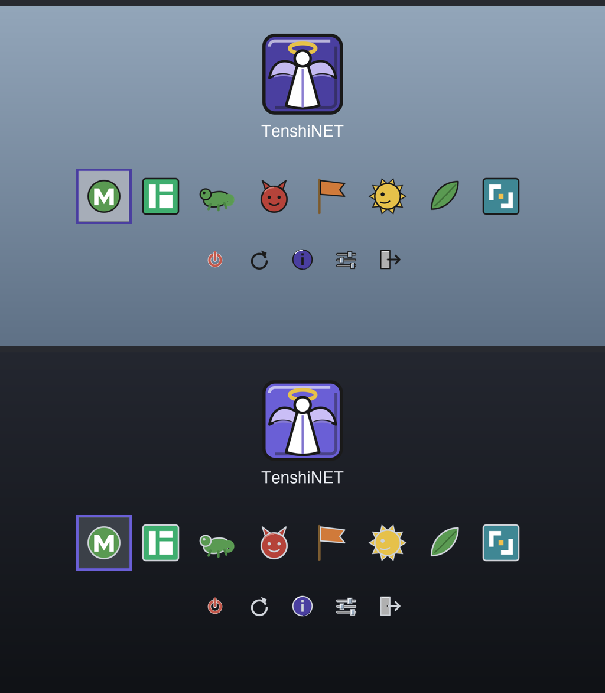

# TenshiSTEP for rEFInd

A [rEFInd](https://www.rodsbooks.com/refind/) boot-manager theme visually
coherent with the TenshiSTEP Plasma theme — the OPENSTEP muted-blue gradient
(or near-black, for dark), the chiselled bevel, and the metallic-indigo accent —
in **light** and **dark** variants.



## Variants

| Folder | Look |
|--------|------|
| `TenshiSTEP/`      | Light — OPENSTEP-blue banner, gunmetal-silver selection tile, indigo frame |
| `TenshiSTEP-dark/` | Dark — near-black banner, dark gunmetal selection tile, bright-indigo frame |

Each contains:

- `theme.conf` — the rEFInd config snippet (banner, selection images, icon dir, sizes).
- `background.png` — the banner: gradient + the beveled TenshiNET cube + title.
- `selection_big.png` / `selection_small.png` — the chiselled NeXT selection
  highlight (beveled tile with an indigo frame) drawn behind the selected entry.
- `icons/` — a coherent icon set in the TenshiSTEP palette:
  - **OS icons** (NeXT-styled, in `os-icons-src/` as SVG): `os_linux` (Tux),
    `os_win`, `os_mac`, `os_arch`, `os_ubuntu`, `os_fedora`, `os_debian`,
    `os_linuxmint`, `os_manjaro`, `os_opensuse`, `os_freebsd`, `os_netbsd`,
    `os_openbsd`, `os_haiku`, `os_pop`, `os_solaris`, `os_gentoo`, `os_void`,
    `os_mageia`, `os_bazzite`, `os_kinoite`, `os_tenshix` (the TenshiNET angel
    emblem — for a TenshiX/TenshiNET boot entry), plus `os_unknown` (and
    aliases `os_mint`, `os_suse`, `os_popos`, `os_tenshi`, `os_tenshinet`).
  - **Volume icons**: `vol_internal`, `vol_external`, `vol_optical`.
  - **Tool icons**: `func_shutdown`, `func_reset` (reboot), `func_about`,
    `func_firmware`, `func_exit`.
  Any OS/tool not covered still falls back to rEFInd's built-ins. No custom font
  is shipped — rEFInd's default is used. Brand marks (Apple, Ubuntu, Fedora, …)
  are NeXT-idiom reinterpretations, not the official logos.

## Install

rEFInd lives on the EFI System Partition, usually mounted at `/boot/efi` or
`/boot`, under `EFI/refind/`. Copy a variant into its `themes/` folder and
`include` it from `refind.conf`:

```bash
sudo ./install-refind.sh /boot/efi/EFI/refind          # light (default)
sudo ./install-refind.sh /boot/efi/EFI/refind dark     # dark
```

or by hand:

```bash
REFIND=/boot/efi/EFI/refind          # adjust to your ESP
sudo mkdir -p "$REFIND/themes"
sudo cp -r TenshiSTEP "$REFIND/themes/"
# add this line to the end of $REFIND/refind.conf:
#   include themes/TenshiSTEP/theme.conf
```

(For the dark variant, copy `TenshiSTEP-dark` and include
`themes/TenshiSTEP-dark/theme.conf` instead.) Only one theme should be
`include`d at a time.

## EFI boot splash (seamless fade)

`efi-splash/TenshiSTEP.png` and `efi-splash/TenshiSTEP-dark.png` (1920×1080
defaults) — plus `-1280x720`, `-2560x1440`, and `-3840x2160` HiDPI variants — are
resolution-matched renders of the rEFInd banner **without** any OS or tool icons — the
same gradient + TenshiNET angel that rEFInd paints *underneath* its menu (they
are literally the same source image as `<variant>/background.png`). Set one as
your firmware's custom boot logo — many UEFI setups have an OEM/boot-logo slot,
or use a tool such as [HackBGRT](https://github.com/Metabolix/HackBGRT) on the
ESP — so the machine fades straight from the firmware splash into rEFInd with no
visual jump: the angel and title stay in the exact same place and rEFInd just
adds the entry icons on top. See `previews/seamless.png` for the pair.

## Status

Assets are rendered from the TenshiSTEP SVGs (transparency recovered via a
two-background compositing pass, since the only SVG rasteriser here bakes a
background). Authored without a UEFI/rEFInd machine to boot it on, so treat the
first boot as the check — `preview.png`-style renders show the intended result.
Tune `big_icon_size` / `small_icon_size` in `theme.conf` to taste.
