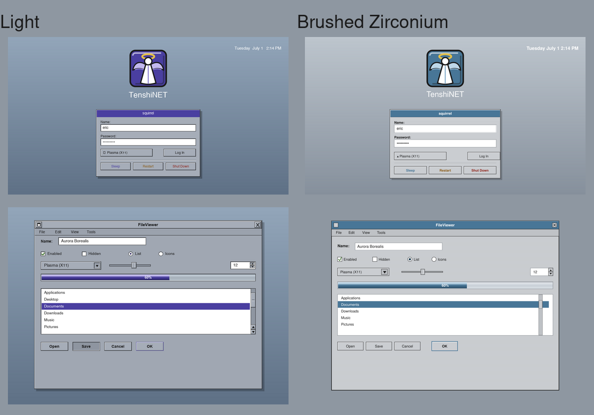
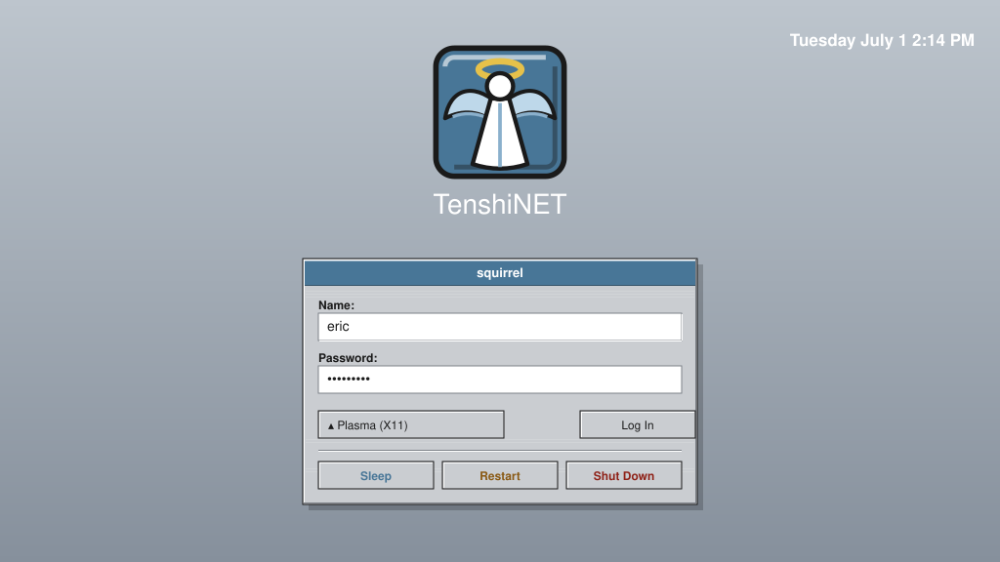
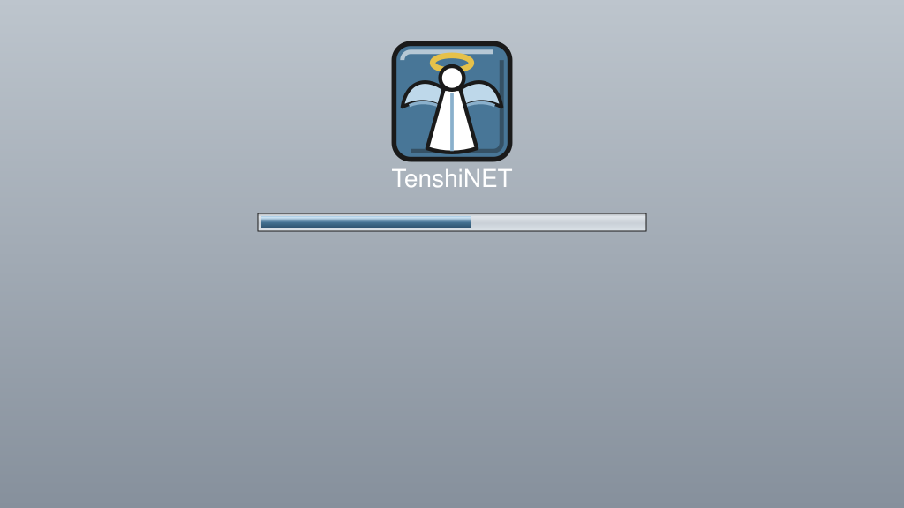
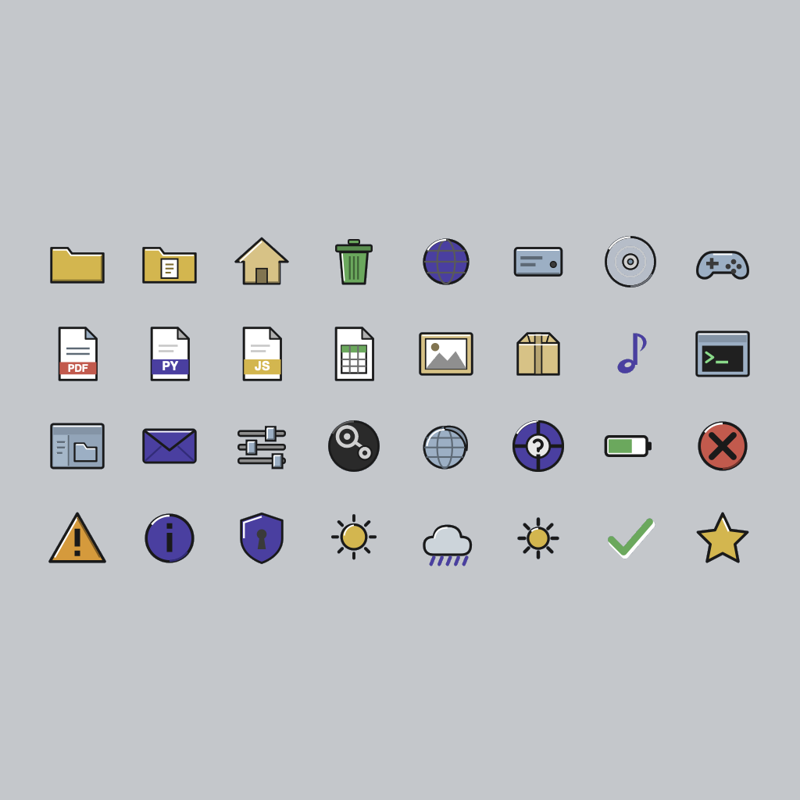
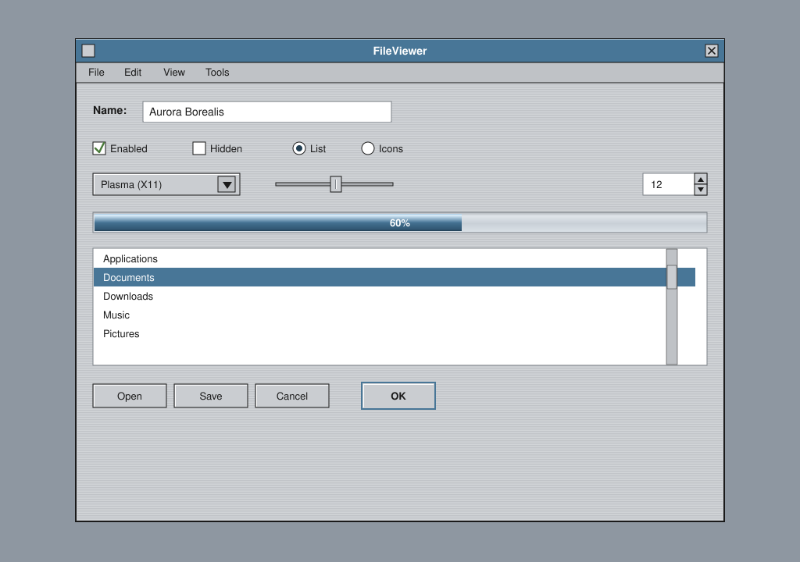
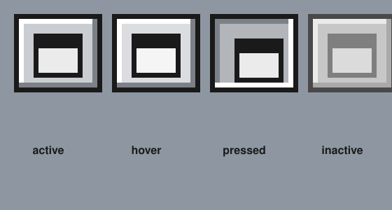

# TenshiSTEP-zirconium for KDE Plasma

A NeXTSTEP/OpenStep-inspired theme bundle for KDE Plasma (5 and 6). It aims
for the classic NeXT look: flat grayscale palette, chiselled bevels (white
highlight on the top/left, dark shadow on the bottom/right), black title
text, and square title-bar buttons.

> **Brushed-metal variant.** This is a third sibling of the light `TenshiSTEP`
> and dark `TenshiSTEP-darkmode` themes: the same light NeXT chrome, a cool
> **steel-blue accent** in place of the NeXT indigo, and a literal
> **brushed-aluminum streak texture** — fine alternating light/dark
> horizontal lines — baked into every flat chrome surface (title bars,
> buttons, panels, the wallpaper). It reuses the light theme's **icon set
> unchanged** (`Icons=TenshiSTEP-zirconium` simply points at the same
> artwork under a renamed directory) since the content areas stay the same
> near-white you already know from the light theme — only the surrounding
> chrome goes metallic. Everything else (colour scheme, Plasma style,
> Kvantum, QSS, QStyle, Aurorae, GTK, SDDM, Global Theme, Plymouth,
> wallpaper) has its own brushed-zirconium build.

**Emblem.** `sddm/TenshiSTEP-zirconium/assets/logo.svg` (and its copies under
`plymouth/`, `lockscreen/`, and the Global Theme's `splash/images/`) is the
standalone TenshiNET angel tile — a steel-blue beveled square, same idiom as
the light/dark emblems, just re-hued. The Global Theme uses it as its icon
(`KPlugin.Icon = tenshistep`, resolved from the shared, unmodified icon set).

**Wallpaper / Plymouth handoff.** `wallpaper/TenshiNET-<WxH>.png`
(1280×720, 1920×1080, 2560×1440, 3840×2160) is a genuine brushed-aluminum
texture — generated from filtered noise (motion-blurred horizontally, then
blended over the boot gradient), not just a flat tint — that *matches the
Plymouth boot splash* (same gradient, same texture recipe, and the TenshiNET
angel in the exact position Plymouth places it) so the machine fades
seamlessly from boot into the desktop. The Global Theme ships the 1080p one
(`contents/wallpaper.png`, wired via `defaults`). The Plasma desktop style
ships a `widgets/combobox.svg` giving dropdowns the same NeXT recessed inset
well (where the running Plasma ComboBox honours it). For a pixel-exact
handoff pick the file matching your native resolution and set it (desktop
**and** SDDM background) with fill mode *Centered* so it is not rescaled.

## Previews

Rendered mocks of the OPENSTEP colour look each piece produces (same
palette, bevels and geometry as the actual theme files; not live
screenshots — except the widget QStyle panel, which *is* a real compiled
screenshot, see below).

The light and zirconium variants side by side (login + widgets):



| | |
|---|---|
| **Login greeter** (SDDM) | **Boot splash** (Plymouth) |
|  |  |
| **Colour icon theme** (unchanged from light) | **Widgets** (QStyle / Kvantum / QSS) |
|  |  |

The widget shot shows the NeXT chiselled bevels, the brushed streak texture,
the twin-arrows-at-the-bottom scrollbar with a dimpled knob, and the 3D
metallic progress bar. Detail of the miniaturize (iconify) button — the
OPENSTEP "miniwindow" glyph in each state:



## What's included

| Piece | Path | What it themes |
|-------|------|----------------|
| Color scheme | `color-schemes/TenshiSTEP-zirconium.colors` | App colors — brushed silver chrome, white views, steel-blue-adjacent selection |
| Window decoration | `aurorae/TenshiSTEP-zirconium/` | Aurorae title bars & borders with beveled square buttons and a literal brushed streak in the title bar / side frame / resize bar |
| Konsole scheme | `konsole/TenshiSTEP-zirconium.colorscheme` | Terminal palette (unchanged from light — same white-on-black-text terminal, same ANSI 16) |
| Icon theme | `icons/TenshiSTEP-zirconium/` | The light theme's OPENSTEP-inspired **colour** icons, verbatim, under a renamed directory; inherits Breeze for the rest |
| SDDM login theme | `sddm/TenshiSTEP-zirconium/` (Qt5) · `sddm/qt6/TenshiSTEP-zirconium/` (Qt6) | OPENSTEP-style QML greeter — chiselled panel with a brushed streak overlay, steel-blue title bar, colour power buttons |
| Plasma Style | `plasma/desktoptheme/TenshiSTEP-zirconium/` | NeXT chiselled FrameSvg widgets (panels, plasmoids, buttons, fields, tooltips), each flat fill carrying the brush texture |
| Global Theme | `plasma/look-and-feel/org.tenshistep.zirconium.desktop/` | Look-and-Feel that applies the whole set + boot splash + logout screen |
| Kvantum theme | `kvantum/TenshiSTEP-zirconium/` | NeXT app-widget style (SVG, 518 elements) for the Kvantum QStyle engine, with the streak texture generated procedurally |
| Qt style sheet | `qt-style/TenshiSTEP-zirconium.qss` | Lightweight NeXT-beveled widget QSS, approximating the brush with a many-stop banded gradient (QSS has no repeating-gradient syntax) |
| Qt QStyle plugin | `qstyle/` | Native C++ widget style — the full NeXT look plus literal `QPainter`-drawn brush streaks (twin-arrow scrollbars, metallic bars) — **built and screenshot-verified here**, see Status |
| Plymouth splash | `plymouth/tenshistep-zirconium/` | OPENSTEP boot splash — chiselled cube + metallic steel-blue progress on a brushed-aluminum gradient |

Application (Qt) widgets have three options, in increasing fidelity: the
**Qt style sheet** (drop-in, no build), the **Kvantum theme** (SVG engine),
and the native **QStyle plugin** (`qstyle/`, compiled C++ — the only one
that can do NeXT's twin-arrows-at-the-bottom scrollbar with a dimpled knob,
true metallic progress bars, and the brush texture as literal per-pixel
paint rather than a baked SVG/gradient approximation). The Plasma Style
covers panel/plasmoid widgets. A Helvetica-like font (Nimbus Sans /
Liberation Sans) completes the look.

### About the icon theme

Unlike the dark variant — which ships its own recoloured icon set because
dark backgrounds need lighter outline strokes to stay legible — zirconium
keeps the **same light content areas** as the base light theme (white view
backgrounds, near-white fields), so the light icon set's `#1a1a1a` chiselled
outlines are already correct here. `icons/TenshiSTEP-zirconium/` is the
light set's ~202 hand-drawn icons plus ~390 alias links, unmodified, just
relocated under the zirconium theme name so it can be selected independently
in System Settings → Icons. The theme **inherits from Breeze**, so any name
not provided falls back to Breeze automatically.

Note: brand marks (Chromium, Firefox, VS Code, Vim, and the game logos) are
**grayscale reinterpretations** in the NeXT idiom, not the official colored
logos — inherited as-is from the light set.

## Install

```bash
./install.sh
```

This copies the files into
`~/.local/share/{color-schemes,aurorae/themes,konsole,icons}`. Nothing is
installed system-wide and nothing outside `~/.local/share` is touched
**except** the optional lock-screen step (see below), which needs root and
is skipped automatically without it.

### Manual install (equivalent)

```bash
mkdir -p ~/.local/share/{color-schemes,aurorae/themes,konsole,icons}
cp color-schemes/TenshiSTEP-zirconium.colors      ~/.local/share/color-schemes/
cp -r aurorae/TenshiSTEP-zirconium                 ~/.local/share/aurorae/themes/
cp konsole/TenshiSTEP-zirconium.colorscheme        ~/.local/share/konsole/
cp -R icons/TenshiSTEP-zirconium                   ~/.local/share/icons/
```

## Apply

- **Colors:** System Settings → Colors → *TenshiSTEP-zirconium*
  (or `plasma-apply-colorscheme TenshiSTEP-zirconium`)
- **Window decoration:** System Settings → Window Decorations → *TenshiSTEP-zirconium*
- **Konsole:** Konsole → Settings → Edit Current Profile → Appearance → *TenshiSTEP-zirconium*
- **Icons:** System Settings → Icons → *TenshiSTEP-zirconium*
  (or `plasma-changeicons TenshiSTEP-zirconium`)

For the authentic NeXT button arrangement, go to
**Window Decorations → Titlebar Buttons** and place **Minimize on the left**
and **Close on the right**.

## SDDM login theme

The login greeter lives under `sddm/TenshiSTEP-zirconium/` (a self-contained
Qt Quick theme, Qt 5). It recreates the OPENSTEP login panel: a chiselled
brushed-silver panel with a steel-blue title bar, the beveled cube emblem,
recessed *Name:* / *Password:* fields, a session selector, a raised *Log In*
button, and colour power buttons (steel-blue Sleep, amber Restart, red Shut
Down) over a brushed-aluminum OPENSTEP-blue gradient. See
`sddm/TenshiSTEP-zirconium/preview.png`.

SDDM themes are system-wide, so installing needs root:

```bash
sddm/install-sddm.sh            # Qt5 greeter (default), copies to /usr/share/sddm/themes
sddm/install-sddm.sh qt6        # Qt6 greeter (Plasma 6 / SDDM built against Qt 6)
```

Then activate it in `/etc/sddm.conf.d/tenshistep.conf`:

```ini
[Theme]
Current=TenshiSTEP-zirconium
```

Preview it without logging out:

```bash
sddm-greeter --test-mode --theme /usr/share/sddm/themes/TenshiSTEP-zirconium
```

Background and panel/title colours are configurable in
`sddm/TenshiSTEP-zirconium/theme.conf` (set `background=` to a wallpaper
path, or leave it empty for the built-in gradient).

The QML is written to the SDDM greeter API. Two variants ship: the Qt5 one
(`sddm/TenshiSTEP-zirconium/`) and a Qt6 one (`sddm/qt6/TenshiSTEP-zirconium/`,
with version-less imports and `function onLoginFailed()` handlers). Both
install to the same theme id; pick the one matching your SDDM's Qt build.

## Global Theme (Look-and-Feel) + splash + logout

`plasma/look-and-feel/org.tenshistep.zirconium.desktop/` is a **Global
Theme**. Its `contents/defaults` wires the whole set together —
TenshiSTEP-zirconium colour scheme, icon theme, Plasma Style, and Aurorae
decoration — so one click applies everything:

```bash
lookandfeeltool -a org.tenshistep.zirconium.desktop     # apply
lookandfeeltool -a org.kde.breeze.desktop                # revert
```

It also ships a **boot splash** (`contents/splash/Splash.qml` — the cube
logo and a filling metallic steel-blue progress bar on the brushed
OPENSTEP gradient) and a **logout screen** (`contents/logout/Logout.qml` —
NeXT panel with colour Sleep / Restart / Shut Down / Log Out / Lock /
Cancel buttons).

**Lock screen — deliberate choice, same as light/dark:** the package does
*not* replace the lock greeter by default via the Global Theme. A custom
lock screen with a mis-bound password/PAM path can lock you out of the
machine. Instead the stock lock screen automatically picks up the
TenshiSTEP-zirconium **colour scheme**, so it's themed without that risk.
`install.sh` *does* offer an optional, root-gated step that installs the
matching `lockscreen/LockScreenUi.qml` into the live desktop shell package
(see the installer's own output for the exact revert command) — the same
opt-in mechanism the light and dark bundles use. The splash and logout QML
are likewise best-effort against the documented KSplash / ksmserver APIs —
verify after applying, and revert with the `breeze` command above if
anything misbehaves.

## Application widgets (QStyle plugin / Kvantum / QSS)

Three ways to give **Qt application** widgets (buttons, scrollbars,
sliders, menus) the NeXT chiselled brushed-metal look — the one layer the
Plasma Style can't reach, in increasing fidelity:

**Native QStyle plugin** (`qstyle/`, compiled C++ — the fullest option).
Only this one can draw NeXT's twin-arrows-at-the-bottom scrollbar with a
dimpled knob, true metallic progress bars, and the brush streaks as literal
per-pixel `QPainter` lines, because it paints the widgets in code:

```bash
qstyle/build-and-install.sh                 # cmake build + install (Qt 5 or 6)
export QT_STYLE_OVERRIDE=TenshiSTEP-zirconium      # or System Settings -> Application Style
```

See `qstyle/README.md` — this one was actually built (Qt 6 / KF 6, zero
warnings) and rendered through `../qstyle-preview/` here, so the widget
panel screenshot is real, not a mock.

**Kvantum** (an SVG-themable QStyle — no compiler needed):

```bash
kvantum/install-kvantum.sh          # copies to ~/.config/Kvantum/TenshiSTEP-zirconium
kvantummanager --set TenshiSTEP-zirconium
# then set the application style to "Kvantum" (System Settings / qt5ct / qt6ct)
```

`kvantum/TenshiSTEP-zirconium/TenshiSTEP-zirconium.svg` (518 elements) is
generated by `tools/gen_kvantum.py`; `TenshiSTEP-zirconium.kvconfig` maps
each widget to it.

**Qt Style Sheet** (`qt-style/TenshiSTEP-zirconium.qss`) — a lighter,
engine-free alternative that works in any Qt app: point qt5ct/qt6ct →
*Appearance → Style Sheets* at it, or launch an app with
`-stylesheet TenshiSTEP-zirconium.qss`.

The Kvantum SVG is generator-produced and script-verified (well-formed XML,
rendered to PNG here for a visual check); the QSS was authored without
Kvantum/Qt on hand to run it, so verify in Kvantum Manager and tune the
frame sizes if a widget looks off. For the exact NeXT scrollbar, metallic
bars, and literal brush texture, prefer the QStyle plugin.

## Plymouth boot splash

`plymouth/tenshistep-zirconium/` is a script-module Plymouth theme: a
brushed-aluminum gradient, the chiselled cube logo, "TenshiNET", and a
filling metallic steel-blue progress bar (see `preview.png`). It supports
boot messages and the encrypted disk password prompt.

```bash
plymouth/install-plymouth.sh                          # copies to /usr/share/plymouth (sudo)
sudo plymouth-set-default-theme -R tenshistep-zirconium # set default (rebuilds initramfs)
```

The installer only copies files; setting it default (which rebuilds the
initramfs) is left as an explicit command. Debian/Ubuntu use
`update-alternatives` instead — see the installer's printed instructions.

## Tweaking the decoration

The window decoration is an [Aurorae](https://develop.kde.org/) SVG theme:

- `decoration.svg` — the 9-slice frame and title bar (active + inactive
  sets), with a literal brushed streak baked into the title bar, side
  frame, resize bar, and maximized bands.
- `close.svg`, `minimize.svg`, `maximize.svg`, `restore.svg` — buttons,
  each with `*-active`, `*-hover`, `*-pressed`, `*-inactive`,
  `*-deactivated` states.
- `TenshiSTEP-zirconiumrc` — geometry: border thickness, title height,
  button size.

Bevel convention used throughout: `#ffffff` highlight on top/left edges,
`#7c8188` shadow on bottom/right, `#cacdd1` brushed-silver fill, `#1a1a1a`
outer frame, `#487697` steel-blue accent (title bar, focus rings, selected
radio dot). Edit the hex values to taste, then re-run `install.sh` and
reselect the decoration (or toggle to another and back) to reload.

## Status / caveats

These files are written to the documented KDE color-scheme, Aurorae, and
Konsole formats. The **QStyle plugin was built and rendered here** (Qt 6 /
KDE Frameworks 6, `qstyle-preview`), so its bevels, brush streaks, and
palette are confirmed correct in an actual compiled widget panel — the
strongest verification any layer in this bundle has. Everything else
(Kvantum SVG, QSS, GTK CSS, SDDM/lockscreen/Plymouth QML) follows the same
palette and bevel math but was **not exercised in a running Plasma
session**, so treat the first install as a test pass. Most likely spots to
need a nudge after you see it live:

- **Title-bar height / button alignment** — tune `TitleHeight`,
  `ButtonHeight`, and `ButtonMarginTop` in `TenshiSTEP-zirconiumrc`.
- **Button state element names** — Aurorae has varied these slightly across
  versions; if a button glyph doesn't show, check that the element ids in
  the button SVG match what your Plasma version expects.
- **Border thickness** — `BorderLeft/Right/Bottom` in
  `TenshiSTEP-zirconiumrc`.
- **Brush density** — the streak pitch (3px in SVG/QPainter, a 6px repeat
  in GTK's `repeating-linear-gradient`) is tuned for 1080p-ish panel sizes;
  scale it up in `tools/gen_kvantum.py` / `tools/gen_plasma_style.py` /
  `qstyle/tenshistepstyle.cpp` if it reads too busy on HiDPI.

Please report (or just fix) anything that renders off and the values above
are the first knobs to turn.
